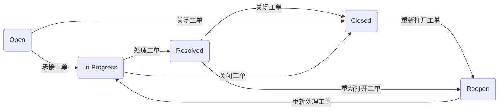

# 说明

## 工单优先级与 SLA
### 生效时间段
- 在工作日的以下时间段生效计时
	- 10:00 - 12:00
	- 14:00 - 18:00
	- 19:00 - 21:00

### 内容
#### 工单优先级及响应规则
- 响应时间：指从工单生成到确定工单处理人不超过各个等级工单的响应时间
- 处理时间：指工单从 in process 状态到 resolved 状态不超过各个等级工单的处理时间

| 优先级   | 响应时间 | 处理时间 |
| -------- | -------- | -------- |
| `High`   | 15m      | 6h       |
| `Medium` | 1h       | 24h      |
| ` Low `  | 1h       | 72h      |

#### 工单状态
- Open: 业务方成功创建工单
- In Progress: 工单处理中
- Resolved: 工单已处理完成，并交付业务方检查
- Closed：
	- 业务方检查通过
	- 业务方需求已通过别的方式解决
	- 超过一天自动关闭
- Reopen：业务方检查 Resolved 工单不通过，或对 Closed 的工单结果仍不满意




注：关于工单的各个状态的转变，工单处理人都能收到邮件通知

# 工单跟进规范
## 第 1 步：确定工单处理顺序
- 优先处理高优先级工单
- 相同优先级工单：根据业务方紧急程度，确定处理顺序
	- 如：紧急线上故障 / 业务方请求优先处理

## 第 2 步：判断工单是否在 SRE 支持范畴
明确 SRE 宗旨： 「用自己的专业能力帮助业务方更高效的完成目标」
- SRE 主要职责：基础设施相关的问题
- 偏业务方层面的工单请求
	- 业务方无法处理的情况：尽自己所能为业务方提供帮助
	- 业务方可以处理的情况：做效率评估，如果 SRE 处理该需求的效率高于业务方，则承接该需求，反之，则向业务方说明情况，不承接该需求

## 第 3 步：处理工单
- 对于 80% 以上常见工单，SRE 均有对应的文档可以参考，根据工单类型或关键字，可快速找到对应类别的工单处理文档，[点击此处，查看现有工单文档](http://wiki.platform.mobiu.space/document/index?document_id=30 "点击此处，查看现有工单文档")

### 可进行工单指派的情况：
- 对于无对应文档参考工单：处理人不知道如何操作，可指派给 SRE 团队有经验的小伙伴，附上工单上下文，如有必要工单处理完成后 @ 小伙伴补充对应的工单处理文档
- 对于工单数量过多，工单处理人无法全部处理，可指派给 SRE 团队小伙伴，并附上工单上下文，及工单参考文档链接

### 工单文档可以解决哪些问题
- 处理工单前需要做哪些工作
	- 工单信息核对
	- 核心需求对接
- 处理工单具体需要做哪些操作
- 如何保证处理结果的可靠性

## 第 4 步：同步工单上下文
- 当一个工单处理完毕时，工单处理人需在该工单的评论区，同步该工单的处理上下文
	- 目的：工单出问题时方便排查，且增强 SRE 在业务方心中的可信度，促进用户满意度的提升
	- 内容：
		- 工单信息核对
		- 业务方核心需求
		- 工单参考文档
		- 工单操作流程概括
		- 工单验证（附验证方式及验证结果）
- [示例参考](http://portal.platform.mobiu.space/ticket/detail/1489 "示例参考")

## 贯穿全程
- 工单作为 SRE 支撑业务方的主要方式，沟通交流必不可少，有效的沟通方式，不仅有利于提高工单处理效率，更有助于提高业务方对 SRE 工作的满意度

### 全局沟通规范(参考 AWS 的工单沟通规范)
- 沟通途径
	- 企业微信
	- 工位或会议室面谈


- 处理工单前的沟通
	- 简短描述我们所理解的业务方核心需求
	- 该核心需求下业务方需要向我们提供哪些必要信息
	- 如有必要信息缺失情况，需向业务方说明还需要提供的必要信息是什么

```markdown
# 示例模版
## 必要信息缺失情况
xxx 老师，根据您提的工单，我理解您的核心需求是：......,该需求下，您还需要向我们提供的必要信息有：
1. xxx
2. xxx

## 请业务方确认核心需求及必要信息是否正确（必需有的步骤）
xxx 老师，根据您提的工单，我理解您的核心需求是：......,您提供的必要信息如下:
1. xxx
2. xxx
......
请确认核心需求和必要信息是否正确

```

- 工单处理过程中的沟通
	- 周期性较长的工单
		- 处理前与业务方对齐预期，明确 Deadline
		- 处理过程中，适当同步当前进度是多少，预计还需要多久完成
	- 过程中需要业务方配合的工单
		- 向业务方说明需要做的配合是什么

```markdown
# 示例模版
## 如：针对 Redis 实例扩容，需要业务方扩容期间需业务方关注服务动态
xxx 老师，针对 Redis 实例：xxx 的扩容，需要您在扩容过程中关注下相关服务动态，如有异常情况随时沟通，感谢配合

```

- 工单结果的交付
	- 简短描述我们所理解的业务方核心需求
	- 该核心需求下我们的处理结果
	- 附结果验证步骤

```markdown
# 示例模版
## 必要信息缺失情况
xxx 老师，您提的工单已经处理完毕，已验证该资源 / 该权限 / 该服务 / ... 可用，处理结果返回如下：
查看地址：xxx
查看方式：xxx
资源名：xxx
服务名：xxx
验证方式及结果：xxx 
```

### 其他需要注意

- 当业务方有跨团队资源修改的情况时需要和各团队负责人拉齐预期
  - 例如 A 团队想修改 B 团队的 Cloudfront 资源，在修改前需要先与 B 团队负责人在修改结果的预期达成一致，再执行 A 团队的需求